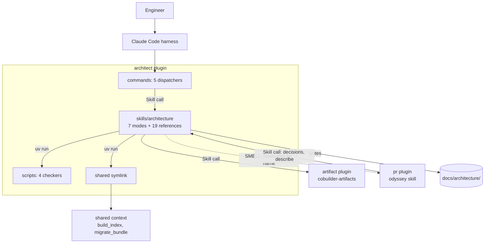
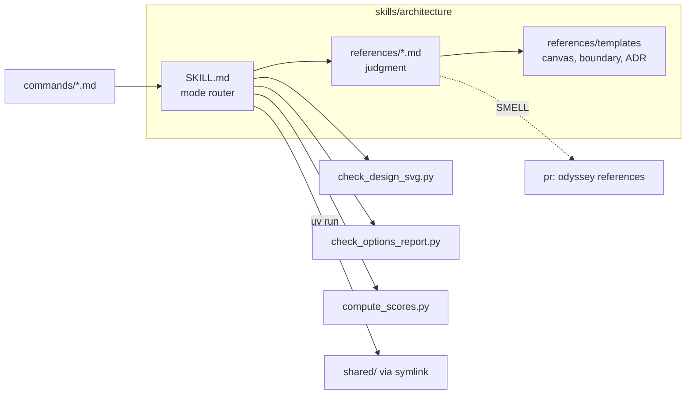

# Bounded Context Canvas — architect

> Documents `plugins/architect` to the [Architecture Documentation Standard](../../standard.md). Grounded in code as of 2026-10-08 (commit `d086be9`). Full treatment. The plugin holds one skill, five commands, and four scripts.

## 1. Name & purpose

**Architect** (`architect`). It helps an engineer decide and govern one repository. Seven modes run through one skill: design, review, maintenance, decisions, describe, debug, and options. It reads the session's own repo and writes judgment into `docs/architecture/`. It does not narrate merged PRs, serve the viewer, or build code.

## 2. Strategic classification

- **Core domain.** It holds the design judgment of the family: interview, challenge, draft, and review.
- **Model trait:** a skill with modes. Commands are thin. Judgment lives in 19 reference files. Four scripts only check and score.

## 3. Ubiquitous language

| Term | Meaning inside this context |
|------|-----------------------------|
| [**Design**](../../../../DDD-VOCABULARY.md#design) | The `/architect:design` mode. It interviews, explores, challenges, and drafts. |
| [**a design**](../../../../DDD-VOCABULARY.md#a-design) | The `docs/architecture/designs/<name>/` directory the mode writes. |
| [**Review**](../../../../DDD-VOCABULARY.md#review) | The `/architect:review` self-only audit. It is not the pr plugin's review mode. |
| [**Bounded context**](../../../../DDD-VOCABULARY.md#bounded-context) | A `canvas.md` and `boundary.yaml` pair that describe mode writes. |
| [**Stale boundary**](../../../../DDD-VOCABULARY.md#stale-boundary) | A context whose `verified_at` commit is missing or older than a change under its path. |
| [**Inquiry**](../../../../DDD-VOCABULARY.md#inquiry) | One question that options mode raises, with evidence and alternatives. |
| [**Runtime architecture diagram**](../../../../DDD-VOCABULARY.md#runtime-architecture-diagram) | The inline SVG that `check_design_svg.py` validates. |
| [**Vocabulary bootstrap**](../../../../DDD-VOCABULARY.md#vocabulary-bootstrap) | The design stage 1 step that loads or seeds the glossary. |
| [**Draft review**](../../../../DDD-VOCABULARY.md#draft-review) | The stage 6 reviewer pass over a draft (ADR-0036). |
| [**Self**](../../../../DDD-VOCABULARY.md#self) | The session's own checkout. It is the only target of every architect mode. |

## 4. Business / capability decisions (what it owns)

- The seven modes and their procedures, including the stage gates of design mode.
- The ADR schema, the decision states, and the ADR templates (`references/decision-records.md`).
- The review corpus, the scoring script, and the founder and technical report templates.
- The describe procedure and the two context templates.
- The check scripts for the design diagram and the options report.
- It does **not** own: the bundle shape, the viewer, PR narration, or the build loop. It does not own the shared scripts it runs.

## 5. Inbound communication (consumers)

| Consumer | Via |
|----------|-----|
| An engineer | `/architect:design`, `review`, `maintenance`, `debug`, `options` |
| The pr plugin | `Skill("architect:architecture")` for decisions mode and `describe <district>` |
| The implement plugin | `commands/debug.md` calls the debug mode (without the `architect:` prefix) |
| The umbrella plugin | Routes by mode name only |

## 6. Outbound communication (dependencies + integration pattern)

| Depends on | Integration pattern |
|------------|--------------------|
| shared | Conformist. Runs `build_index`, `migrate_bundle`, `prose_budget`, `boundary_check`, and `validate_decision_state` by `uv run`. No Python import. |
| artifact | Open host service. `Skill("cobuilder-artifacts", args="view")` serves the bundle and gives the review link. |
| pr | **SMELL.** Design mode reads the odyssey skill's `SKILL.md` and five reference files by name. See Recorded smells. |

## 7. Public interface (what it publishes)

The five commands, the seven modes of `Skill("architect:architecture")`, the vendored `architect:mermaid` and `architect:ste-writing` skills, and the scripts `check_design_svg.py` and `check_options_report.py`. It matches `boundary.yaml` `public_interface`.

## 8. Owned data / state

- `docs/architecture/{adr,designs,contexts,review,options}/` and `INVENTORY.md`, as authored source.
- `DDD-VOCABULARY.md`, edited by design mode.
- No bundle data. The bundle belongs to the pr and shared contexts, and `build_index.py` writes the index.

---

## C2 — Container diagram

## C3 — Component diagram

**Key invariant(s) (encoded in `boundary.yaml`):** The four scripts import neither shared nor a sibling plugin. Each command makes one `Skill("architecture")` call. No agents and no hooks ship here (ADR-0025). The plugin names no path of another plugin.

## Recorded smells (→ ADR candidates)

1. **Design mode reads the pr plugin's odyssey skill by file.** `references/design-mode.md` has 10 mentions, `SKILL.md` has 8 (Hub resolution at line 85, Review mode step 4 at line 163), and `references/decision-records.md` has 1. They name `interview-guide.md`, `review-mode.md`, `pr-description-template.md`, and `decision-records-lite.md`. The pr plugin is not in the architect manifest, so the files may not exist. ADR candidate: move the shared text to `shared/`.
2. **Unprefixed cross-plugin Skill names.** architect calls `Skill("cobuilder-artifacts")` with no `artifact:` prefix. The pr plugin prefixes its calls. Low risk, but the form should match.

## Governing decisions

ADR-0011 (design mode), ADR-0015 (self-only modes), ADR-0035 (options proposes, design decides), and ADR-0036 (design runtime structure, contracts, draft review). All four anchor to `cobuilder-packaging`, so `governed_by` here stays empty. See the packaging record for the re-anchor candidate.
