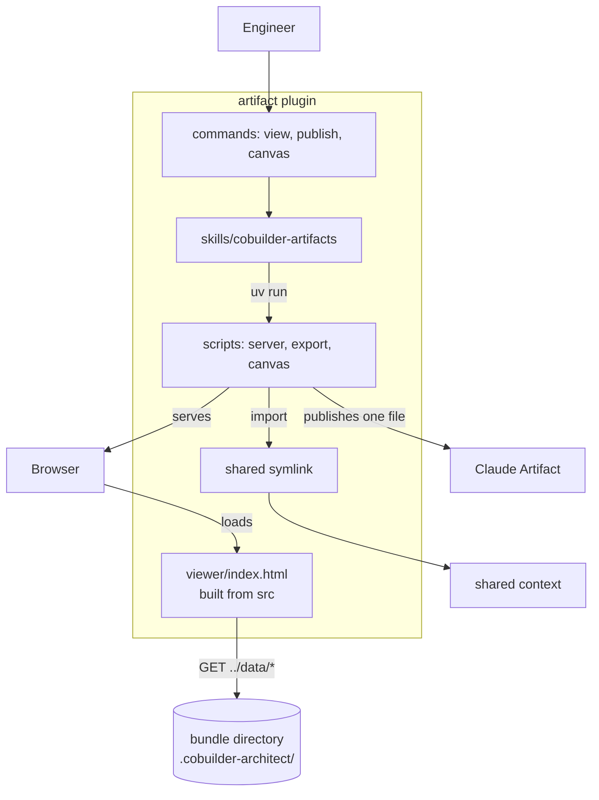
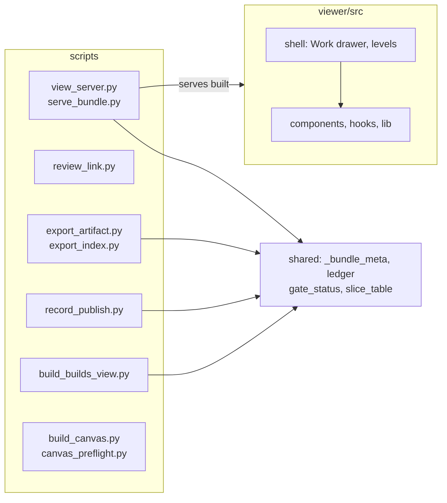

# Bounded Context Canvas — artifact

> Documents `plugins/artifact`, including the viewer under `plugins/artifact/viewer`, to the [Architecture Documentation Standard](../../standard.md). Grounded in code as of 2026-10-08 (commit `d086be9`). Full treatment. One skill, three commands, ten scripts, and a viewer of 174 TypeScript files.

## 1. Name & purpose

**artifact** (`artifact`). It shows the work of the family. `view` serves a bundle and opens the viewer. `publish` flattens one PR into a single HTML Claude Artifact under the 16 MiB cap. `canvas` draws a design. It also runs review links and the anchored-comments ledger. It does not write the content it shows.

## 2. Strategic classification

- **Supporting domain.** It makes the content of other contexts visible and reviewable.
- **Model trait:** a single-page application over a data directory. The viewer is a React app with a build step. Scripts serve, export, and record.

## 3. Ubiquitous language

| Term | Meaning inside this context |
|------|-----------------------------|
| [**Bundle**](../../../../DDD-VOCABULARY.md#bundle) | The directory the viewer reads through `../data/*`. Root the server at `.cobuilder-architect/`. |
| [**Command**](../../../../DDD-VOCABULARY.md#command) | One of `view`, `publish`, `canvas`. Each dispatches into the one skill. |
| [**Skill**](../../../../DDD-VOCABULARY.md#skill) | `cobuilder-artifacts`. It also holds the Present for review procedure. |
| [**Script**](../../../../DDD-VOCABULARY.md#script) | A PEP 723 file such as `view_server.py`, which serves on fixed port 62583. |
| [**Self**](../../../../DDD-VOCABULARY.md#self) | The session's own checkout, where the bundle lives at `.cobuilder-architect/self/`. |
| [**foreign**](../../../../DDD-VOCABULARY.md#foreign) | A `--repo` bundle under the hub. The viewer shows it without owning it. |
| [**Epic**](../../../../DDD-VOCABULARY.md#epic) | A design's work unit. The Work board and the Build page group slices by epic. |

## 4. Business / capability decisions (what it owns)

- The viewer shell: Work board drawer (ADR-0034), paged levels (ADR-0028), and the record rail.
- Review links and the anchored-comments ledger endpoint (ADR-0019, ADR-0032).
- The local server and its fixed port.
- The publish step, its provenance record, and the 16 MiB size check.
- The tldraw canvas export of a design.
- It does **not** own: bundle content, the data shape (shared), the record index (shared), or the story (pr).

## 5. Inbound communication (consumers)

| Consumer | Via |
|----------|-----|
| An engineer | `/artifact:view`, `/artifact:publish`, `/artifact:canvas` |
| The architect plugin | `Skill("cobuilder-artifacts", args="view")` and the review link |
| The implement plugin | `Skill("cobuilder-artifacts")` with the epics route |
| `shared/migrate_bundle.py` | Copies the committed `viewer/index.html` into a bundle (SMELL, owned by shared) |

## 6. Outbound communication (dependencies + integration pattern)

| Depends on | Integration pattern |
|------------|--------------------|
| shared | Shared kernel. Five scripts import `_bundle_meta`, `ledger`, `gate_status`, and `slice_table`. |
| The bundle directory | Open host service. Over HTTP, read only, except the ledger append. |
| pr | Conformist. Error text names `/pr:baseline`, `/pr:review`, and `/pr:generate` as the remedy. |
| The session's `docs/` | Data-only reads of `designs/` and `plans/`. |

## 7. Public interface (what it publishes)

The three commands, `Skill("cobuilder-artifacts")`, the built `viewer/index.html`, `view_server.py`, `review_link.py`, and `export_artifact.py`. It matches `boundary.yaml`.

## 8. Owned data / state

- `viewer/src` and the committed `viewer/index.html`. A test fails if the build does not reproduce the committed bytes.
- The anchored-comments ledger file through `ledger.py` (the code lives in shared).
- Publish provenance written by `record_publish.py`.
- No story, ADR, or index data.

---

## C2 — Container diagram

## C3 — Component diagram

**Key invariant(s) (encoded in `boundary.yaml`):** The viewer is a leaf. It reads `../data/*` and never a script or a plugin path. Scripts import only shared modules. The plugin calls no other plugin's skill.

## Recorded smells (→ ADR candidates)

No smell is owned by this context. Two edges that other contexts own touch it:

1. `shared/migrate_bundle.py` probes `plugins/artifact/viewer/index.html` and the sibling install cache (see the shared canvas).
2. `plugins/implement/scripts/verify_gate.py` names `plugins/artifact/scripts/build_builds_view.py` in a comment (see the implement canvas).

## Governing decisions

ADR-0019 (anchored comments), ADR-0023 (React viewer and Vite build), ADR-0028 (paged level), ADR-0032 (review link), and ADR-0034 (Work board drawer). All anchor to `cobuilder-packaging`, so `governed_by` here stays empty.
