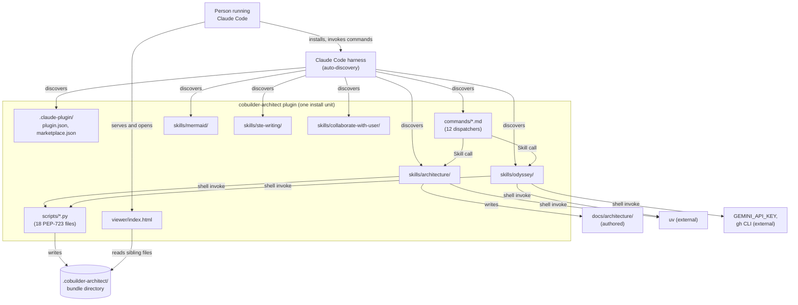
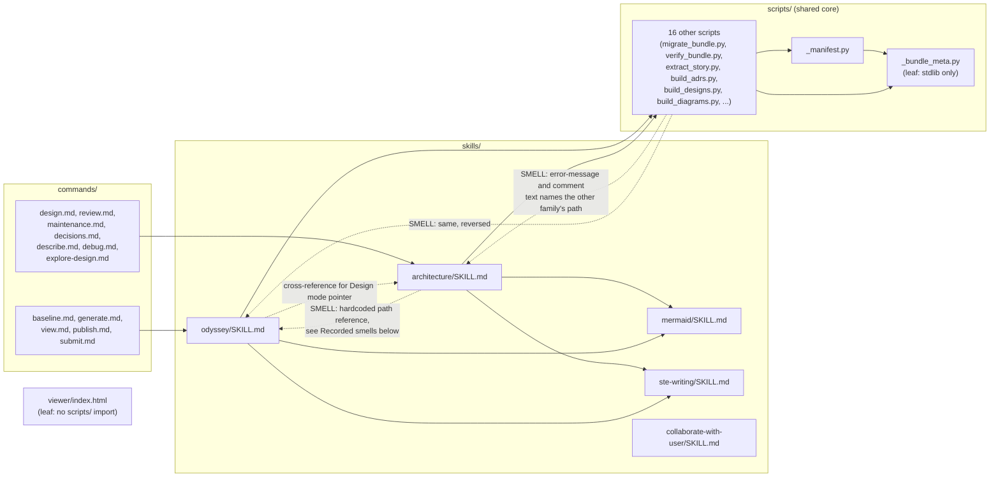

# Bounded Context Canvas — cobuilder-packaging

> Documents the packaging surface of this repository — `.claude-plugin/`, `commands/`,
> `skills/`, `scripts/`, and `viewer/` — to the
> [Architecture Documentation Standard](../../standard.md). Grounded in code as of
> 2026-08-21. This context is the install surface today: one plugin, `cobuilder-architect`,
> version `0.4.0`. ADR-0016 proposes splitting it into five sibling plugins. That split has
> not happened. This canvas documents the current, single-plugin shape, and flags the
> coupling that must resolve before the split can proceed.

## 1. Name & purpose

**cobuilder-packaging** (`cobuilder-packaging`). Governs how this plugin is packaged,
installed, and how its own parts reach each other: the plugin manifest, the command
dispatchers, the five skills, the standalone scripts, and the bundle viewer. It does not
own the content those parts produce (narrative, ADRs, review reports). It owns the wiring
that lets a user install the plugin and lets its parts call one another.

## 2. Strategic classification

- **Supporting domain** — it is infrastructure for the other bounded contexts this plugin
  will eventually document (Odyssey generation, architecture review, the bundle format
  itself). Nobody outside this project depends on it; it exists to let the other contexts
  ship as one installable unit.
- **Model trait:** dispatch-and-vendor. Commands are thin dispatchers to skills. Scripts
  are standalone PEP-723 entry points invoked by shell, not by Python import across
  module boundaries except for one small shared core (`_bundle_meta.py`, `_manifest.py`).

## 3. Ubiquitous language

| Term | Meaning inside this context |
|------|-----------------------------|
| **Plugin** | The single installable unit declared in `.claude-plugin/plugin.json`. Today there is one: `cobuilder-architect`. |
| **Command** | A thin dispatcher file under `commands/*.md`. Its only job is one `Skill(...)` call. |
| **Skill** | An auto-discovered directory under `skills/`. Five exist today: `architecture`, `odyssey`, `mermaid`, `ste-writing`, `collaborate-with-user`. |
| **Script** | A standalone PEP-723 `uv run` Python file under `scripts/`. No `venv`, no `requirements.txt`. |
| **Bundle** | The derived output directory (`.cobuilder-architect/<slug>/` or `self/`) that scripts write and the viewer reads. It is this context's output, not a module inside it. |
| **Vendoring** | The mechanism ADR-0017 proposes for sharing code between plugins after a split: a symlinked `shared/` directory at the marketplace root, dereferenced into each plugin's install cache. Not yet built. |

<!-- "Skill" and "command" carry the same meaning across the whole repo — no homonym
     conflict with the odyssey/architecture vocabulary table in CLAUDE.md, which
     disambiguates a different pair of words ("design", "review"). -->

## 4. Business / capability decisions (what it owns)

- The plugin manifest and marketplace listing (`.claude-plugin/`).
- The 12 command dispatchers and which skill each one invokes.
- The five skill directories, their `SKILL.md` orchestration, and their `references/`.
- The 18 standalone Python scripts, and the one shared import edge between them
  (`_bundle_meta.py`, `_manifest.py`).
- The single-file bundle viewer (`viewer/index.html`) and its sibling-file contract with
  the bundle it renders.
- It does **not** own: the bundle's data shape (that is `story.json`'s
  `meta.schema_version`, a concern of whichever future context documents the bundle
  format), the narrative or ADR content the skills produce, or the review corpus under
  `skills/architecture/references/corpus/`.

## 5. Inbound communication (consumers)

| Consumer | Via |
|----------|-----|
| A person running Claude Code | `/plugin install cobuilder-architect@cobuilder-architect`, then `/cobuilder-architect:<command>` |
| The Claude Code harness | Auto-discovers `commands/*.md` and `skills/*/SKILL.md` by directory convention; no manifest entry needed for either. |

## 6. Outbound communication (dependencies + integration pattern)

| Depends on | Integration pattern |
|------------|--------------------|
| The bundle directory (`.cobuilder-architect/`) | Data-only. Scripts write it, the viewer reads it. Neither reads the other's source. |
| `uv` (PEP-723 inline dependency resolution) | External tool dependency, invoked by shell, not imported. |
| `GEMINI_API_KEY`, `gh` CLI | External services, gated behind the prereq check in `skills/odyssey/SKILL.md`, not part of this context's own code. |

This context has no `allowed_dependencies` on another *documented* bounded context yet,
because no other context in this repository has a `boundary.yaml` of its own.

## 7. Public interface (what it publishes)

- The 12 slash commands under `commands/*.md` (`/cobuilder-architect:baseline`,
  `generate`, `view`, `publish`, `submit`, `design`, `review`, `maintenance`,
  `decisions`, `describe`, `debug`, `explore-design`).
- The five skill names, invocable directly via `Skill("<name>", args=...)`:
  `architecture`, `odyssey`, `mermaid`, `ste-writing`, `collaborate-with-user`.
- `scripts/_bundle_meta.py`'s three constants (`SCHEMA_VERSION`,
  `SCHEMA_VERSION_KNOWN`, `CURRENT_BUNDLE_FORMAT`), imported by six other scripts in the
  same directory.
- `scripts/_manifest.py`'s `rewrite_manifest`, imported by `extract_diffs.py`,
  `generate_prompts.py`, and `extract_story.py`.

## 8. Owned data / state

- `.claude-plugin/plugin.json` and `marketplace.json` — the install-time manifest.
- The `commands/`, `skills/`, and `scripts/` trees themselves, as version-controlled
  source.
- `viewer/index.html` — a single HTML file with no state of its own; it renders whatever
  bundle it is served next to.

It does not own bundle content (`.cobuilder-architect/*/data/`, `assets/`, `exports/`) —
that is written and read through the data-only interface in section 6, never imported as
code.

---

## C2 — Container diagram

## C3 — Component diagram

**Key invariant(s) (encoded in `boundary.yaml`):** `_bundle_meta.py` is a leaf module —
stdlib-only, no outbound imports, imported by six other scripts. No script imports
`skills/` as code (only as text inside error strings and comments, which is the smell
recorded below). `viewer/index.html` never reaches into `scripts/`; it reads only
`../data/*.js` sibling files at runtime.

## Recorded smells (→ ADR candidates)

Two coupling patterns were found while verifying import edges. Neither breaks anything
today, because both skill families still ship inside one plugin. Both become real
cross-plugin violations of ADR-0016's invariant — "no plugin reads, imports, or invokes
another plugin's files" — the moment `cobuilder-architect` and `cobuilder-pr` become
separate install units, as ADR-0016 proposes.

1. **`skills/architecture/SKILL.md` hardcodes a path into `skills/odyssey/SKILL.md`.**
   Design mode's Stage 1 step 2 reads: "Resolve `<bundle-dir>` per Hub resolution in
   `skills/odyssey/SKILL.md`". Verified at
   `skills/architecture/SKILL.md:83-84`. `skills/odyssey/SKILL.md:32-33` returns the
   reference: "Designing a change before any code exists is Design Mode, and it lives in
   the `architecture` skill. See `skills/architecture/SKILL.md`." The coupling runs both
   directions.
2. **Six scripts embed the other skill family's path in error text or comments, not in
   an import.** `scripts/build_designs.py:299` and `scripts/build_adrs.py:217` point a
   validation-failure message at `skills/architecture/references/...`.
   `scripts/build_diagrams.py:9,273`, `scripts/render_review.py:9`, and
   `scripts/verify_bundle.py:86` point at `skills/odyssey/references/...`. These are
   human-readable remediation hints, not code imports, so they do not execute a
   cross-plugin call. They are still a textual coupling a split must account for, because
   the hint would name a path the reading plugin cannot open.

Both are listed as `forbidden_dependencies` entries marked `SMELL` in `boundary.yaml`.
Resolving them belongs to whichever ADR carries out the ADR-0016 split, not to this
canvas.

## Governing decisions

- ADR-0016 — Five sibling plugins, with the bundle as the only seam. State: `tentative`,
  blocked on this boundary record existing. This canvas and `boundary.yaml` satisfy that
  block; the ADR's own state transition is a separate, human step.
- ADR-0017 — Vendored shared code, and a compatibility gate the bundle owns. State:
  `tentative`, same block. Its `require_compatible()` function does not exist yet —
  verified absent from `scripts/_bundle_meta.py` as of this canvas's `last_verified`
  date. The gate is a design, not yet an implementation.
