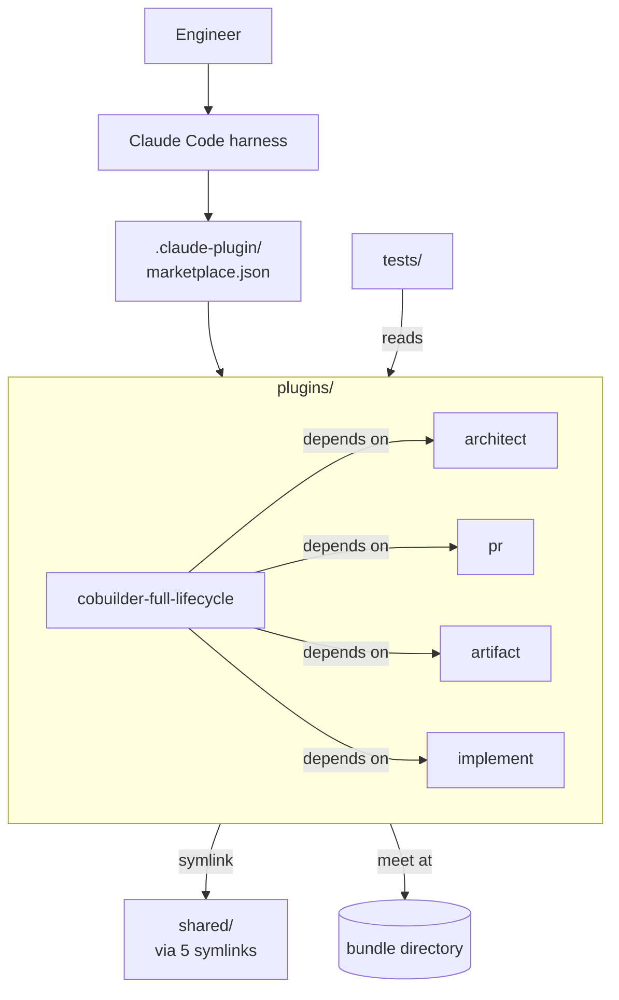
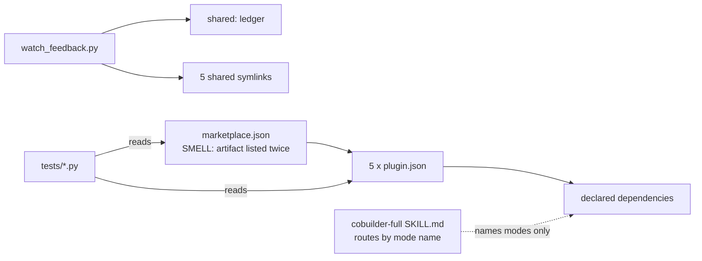

# Bounded Context Canvas — cobuilder-packaging

> Documents the install surface of the repository to the [Architecture Documentation Standard](../../standard.md). Re-verified against code on 2026-10-08 (commit `d086be9`). The 2026-08-21 canvas described one plugin with `commands/`, `skills/`, `scripts/`, and `viewer/` at the root. Those directories no longer exist. This canvas describes the marketplace, five plugins, and five symlinks. The content of each plugin has its own context.

## 1. Name & purpose

**cobuilder-packaging** (`cobuilder-packaging`). It governs how the repo is packaged and installed: the marketplace manifest, the five plugin manifests, the umbrella plugin, the `shared/` symlinks, and the tests that guard them. It does not own what a plugin does.

## 2. Strategic classification

- **Supporting domain.** It is infrastructure for the plugin contexts.
- **Model trait:** manifest and dispatch. The harness discovers commands and skills by directory. A manifest only declares a version and its dependencies.

## 3. Ubiquitous language

| Term | Meaning inside this context |
|------|-----------------------------|
| [**Plugin**](../../../../DDD-VOCABULARY.md#plugin) | An installable unit with a `plugin.json`. Five exist: `architect`, `pr`, `artifact`, `implement`, and the umbrella. |
| [**Command**](../../../../DDD-VOCABULARY.md#command) | A thin dispatcher with one `Skill(...)` call into its own plugin. |
| [**Skill**](../../../../DDD-VOCABULARY.md#skill) | An auto-discovered directory under a plugin. |
| [**Script**](../../../../DDD-VOCABULARY.md#script) | A PEP 723 file run by `uv run`. |
| [**Bundle**](../../../../DDD-VOCABULARY.md#bundle) | The derived directory. It is the one seam between plugins. |
| [**Vendoring**](../../../../DDD-VOCABULARY.md#vendoring) | The symlink of `shared/` into each plugin root. |

## 4. Business / capability decisions (what it owns)

- `.claude-plugin/marketplace.json`, and the match between its versions and each `plugin.json`.
- The umbrella plugin: its manifest, the `cobuilder-full` routing skill, and `watch_feedback.py`.
- The rule that plugins meet only at the bundle and through named Skill calls (ADR-0016).
- The five symlinks (ADR-0017) and the install surface rule (ADR-0025).
- The pytest suite in `tests/` and `scripts/export-agent-skills.sh`.
- It does **not** own: plugin behavior, the bundle shape (shared), or authored docs.

## 5. Inbound communication (consumers)

| Consumer | Via |
|----------|-----|
| An engineer | `/plugin install` from the marketplace, then `/<plugin>:<command>` |
| The Claude Code harness | Discovers `commands/`, `skills/`, `agents/`, and `hooks/` by directory |

## 6. Outbound communication (dependencies + integration pattern)

| Depends on | Integration pattern |
|------------|--------------------|
| architect, pr, artifact, implement | Open host service. Lists and versions them, and never reads their files. |
| shared | Shared kernel. `watch_feedback.py` imports `ledger`. |
| `uv` | External tool, run by shell. |

## 7. Public interface (what it publishes)

The marketplace manifest, the five plugin manifests, `Skill("cobuilder-full")`, `watch_feedback.py`, and `scripts/export-agent-skills.sh`.

## 8. Owned data / state

- The manifests and the umbrella plugin source.
- The `tests/` suite and its fixtures.
- It does not own the bundle, the `docs/` content, or plugin source.

---

## C2 — Container diagram

```mermaid
flowchart TB
    eng["Engineer"]
    harness["Claude Code harness"]
    market[".claude-plugin/<br/>marketplace.json"]
    subgraph plugins["plugins/"]
        arch["architect"]
        pr["pr"]
        art["artifact"]
        imp["implement"]
        umb["cobuilder-full-lifecycle"]
    end
    shared["shared/<br/>via 5 symlinks"]
    bundle[("bundle directory")]
    tests["tests/"]

    eng --> harness
    harness --> market
    market --> plugins
    umb -->|depends on| arch
    umb -->|depends on| pr
    umb -->|depends on| art
    umb -->|depends on| imp
    plugins -->|symlink| shared
    plugins -->|meet at| bundle
    tests -->|reads| plugins
```

## C3 — Component diagram

```mermaid
flowchart LR
    mm["marketplace.json<br/>SMELL: artifact listed twice"]
    pj["5 x plugin.json"]
    skill["cobuilder-full SKILL.md<br/>routes by mode name"]
    wf["watch_feedback.py"]
    led["shared: ledger"]
    sym["5 shared symlinks"]
    tst["tests/*.py"]
    dep["declared dependencies"]

    mm --> pj
    pj --> dep
    skill -.->|names modes only| dep
    wf --> led
    wf --> sym
    tst -->|reads| mm
    tst -->|reads| pj
```

**Key invariant(s) (encoded in `boundary.yaml`):** A plugin never names another plugin's path. Each plugin reaches shared code only through its own symlink. Only `implement` ships agents and a hook.

## Recorded smells (→ ADR candidates)

1. **`marketplace.json` lists `artifact` twice.** The entries at lines 21-26 and 27-32 are identical. Remove one entry. A version bump must today change both.
2. **ADRs anchor to a context that no longer has those paths.** ADR-0016 `maps_to.modules` names `.claude-plugin/`, `commands/`, `skills/`, `scripts/`, `viewer/` at the root. 20 more ADRs anchor to this context. ADR candidate: re-anchor each ADR to the context it changed.
3. **Cross-plugin coupling found in the plugin contexts.** architect reads odyssey files by name. pr cites architect files and omits architect from its manifest. implement and shared name an artifact path in a comment. shared probes the artifact viewer file. Each smell sits in the record of the owning context.
4. **Resolved since 2026-08-21.** The old record held four smells about `skills/odyssey` and `skills/architecture` paths in scripts. Grep finds none of the script strings now. The ADR-0017 `require_compatible` gate exists at `shared/_bundle_meta.py` line 84.

## Governing decisions

- ADR-0016 — Five sibling plugins, with the bundle as the only seam. State: `approved`.
- ADR-0017 — Vendored shared code and a compatibility gate the bundle owns. State: `approved`.
- ADR-0024 — Vendored design-to-code and a conditional interaction gate. State: `approved`.
