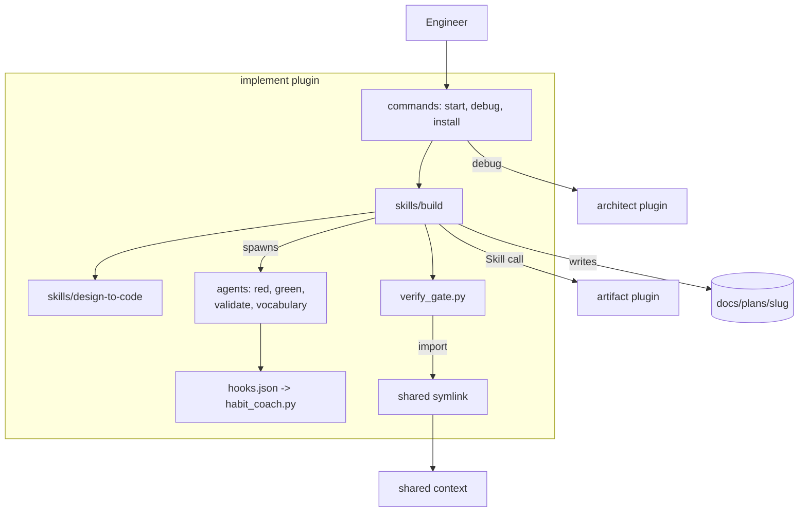
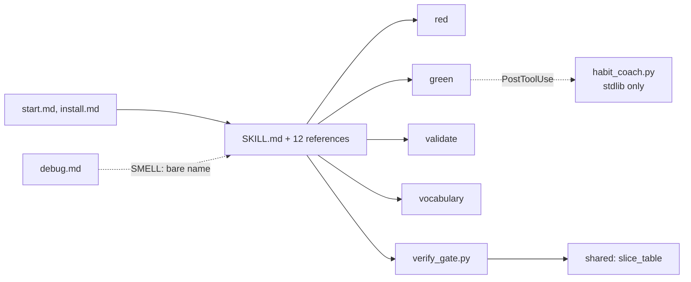

# Bounded Context Canvas — implement

> Documents `plugins/implement` to the [Architecture Documentation Standard](../../standard.md). Grounded in code as of 2026-10-08 (commit `d086be9`). Full treatment. Two skills, three commands, four agents, one hook, two scripts.

## 1. Name & purpose

**implement** (`implement`). It builds a design one vertical slice at a time. Four approval gates come first. Then a RED, GREEN, VALIDATE loop runs for each slice. An independent validator must score a slice 0.90 or higher against a blind rubric. It does not decide the design, and it does not show the result.

## 2. Strategic classification

- **Core domain.** It turns a decided design into tested code under human gates.
- **Model trait:** a state machine of gates plus a role-based loop. `00-status.md` holds the state. `verify_gate.py` checks it.

## 3. Ubiquitous language

| Term | Meaning inside this context |
|------|-----------------------------|
| [**Epic**](../../../../DDD-VOCABULARY.md#epic) | One unit of `goal.json.epics[]`. It joins a design to a PR. |
| [**Gate 4a / 4b / 4c**](../../../../DDD-VOCABULARY.md#gate-4a-4b-4c) | The slice plan, the epic technical design, and the blind rubrics. |
| [**Gate 2b**](../../../../DDD-VOCABULARY.md#gate-2b) | The interaction-design gate that runs only for a feature with a front end. |
| [**Plugin**](../../../../DDD-VOCABULARY.md#plugin) | The installable unit. This one is the only plugin that ships agents and a hook. |
| [**Command**](../../../../DDD-VOCABULARY.md#command) | `start`, `debug`, and `install`. |
| [**Skill**](../../../../DDD-VOCABULARY.md#skill) | `build` holds the procedure. `design-to-code` is vendored (ADR-0024). |

## 4. Business / capability decisions (what it owns)

- The four gates and their status lines in `docs/plans/<slug>/00-status.md`.
- The slice loop, the blind rubric, and the 0.90 threshold.
- The four agents: `red`, `green`, `validate`, and `vocabulary`.
- The `PostToolUse` hook that coaches GREEN through habit-hooks.
- The gate verifier, `verify_gate.py`.
- It does **not** own: the design record (architect), the viewer (artifact), the slice-table parser (shared), or the debug procedure (architect).

## 5. Inbound communication (consumers)

| Consumer | Via |
|----------|-----|
| An engineer | `/implement:start`, `/implement:debug`, `/implement:install` |
| The agents | The `build` skill spawns `red`, `green`, `validate`, and `vocabulary` once per slice |
| The artifact plugin | Reads `docs/plans/<slug>` through `shared/build_index.py` and `build_builds_view.py` (data only) |

## 6. Outbound communication (dependencies + integration pattern)

| Depends on | Integration pattern |
|------------|--------------------|
| shared | Shared kernel. `verify_gate.py` imports `slice_table`. The skill runs `build_index` by shell. |
| architect | Open host service. `debug` calls the architect debug mode. **SMELL:** the call has no plugin prefix. |
| artifact | Open host service. `Skill("cobuilder-artifacts")` shows a gate and the epics route. |

## 7. Public interface (what it publishes)

The three commands, `Skill("implement:build")`, `Skill("implement:design-to-code")`, the four agents, `verify_gate.py`, and the one hook. It matches `boundary.yaml`.

## 8. Owned data / state

- `docs/plans/<slug>/`: status file, gate documents, epic designs, and rubrics.
- Slice code and test changes in the engineer's repo.
- No bundle data and no viewer state.

---

## C2 — Container diagram

## C3 — Component diagram

**Key invariant(s) (encoded in `boundary.yaml`):** Only this plugin ships agents and a hook (ADR-0025). `habit_coach.py` is stdlib only. `verify_gate.py` imports only `slice_table` from shared. The plugin names no path of another plugin.

## Recorded smells (→ ADR candidates)

1. **A comment names an artifact path.** `scripts/verify_gate.py` lines 98-100 name `plugins/artifact/scripts/build_builds_view.py`. It is a comment, so nothing breaks. Name the shared parser only.
2. **A bare cross-plugin Skill name.** `commands/debug.md` line 26 calls `Skill("architecture")`. Use `architect:architecture`.

## Governing decisions

ADR-0012 (implement), ADR-0013 (design-mode and implement join), ADR-0024 (vendored design-to-code), ADR-0025 (slice agents and a coaching hook), and ADR-0030 (check a change against the program). ADR-0024, ADR-0025, and ADR-0030 anchor to `cobuilder-packaging`. So `governed_by` here stays empty.
