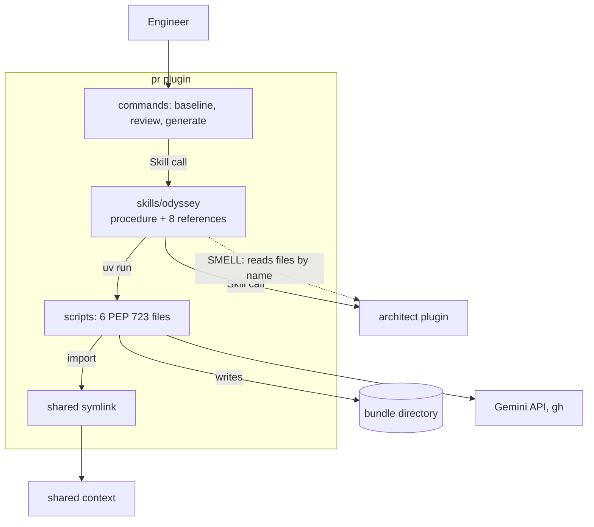
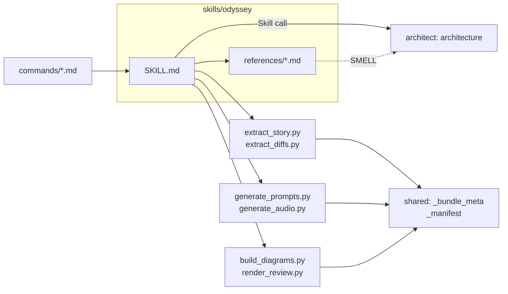

# Bounded Context Canvas — pr

> Documents `plugins/pr` to the [Architecture Documentation Standard](../../standard.md). Grounded in code as of 2026-10-08 (commit `d086be9`). Full treatment. One skill (`odyssey`), three commands, six scripts.

## 1. Name & purpose

**pr** (`pr`), also called Odyssey. It tells the story of a change in four levels: intent, problem and solution, architecture, and file changes. It narrates merged PRs (`baseline`, `review`) and interviews the author before a PR opens (`generate`). It writes the bundle. It does not own the viewer, the ADR schema, or design judgment.

## 2. Strategic classification

- **Core domain.** The narrated story is the product that the family shows.
- **Model trait:** pipeline. Scripts fetch diffs, build prompts, and make audio and diagrams. Claude writes every field of judgment. `verify_bundle.py` gates the result.

## 3. Ubiquitous language

| Term | Meaning inside this context |
|------|-----------------------------|
| [**District**](../../../../DDD-VOCABULARY.md#district) | A `world.districts` entry that describe-lite infers for any repo. |
| [**Review mode**](../../../../DDD-VOCABULARY.md#review-mode) | The `/pr:review` sweep that narrates merged history. |
| [**review-mode.md**](../../../../DDD-VOCABULARY.md#review-mode-md) | The reference for the three-question assessment of `/pr:generate`. |
| [**Assessment stage**](../../../../DDD-VOCABULARY.md#assessment-stage) | The `stage` field of `assessment.json`. |
| [**Drift**](../../../../DDD-VOCABULARY.md#drift) | An assessment finding that a shipped record no longer matches the tree. |
| [**Bundle**](../../../../DDD-VOCABULARY.md#bundle) | The derived directory that the scripts write and the viewer reads. |
| [**foreign**](../../../../DDD-VOCABULARY.md#foreign) | A `--repo` target. Only this plugin reaches one. |
| [**Script**](../../../../DDD-VOCABULARY.md#script) | A PEP 723 file run by `uv run`. It moves data and never writes narrative. |

## 4. Business / capability decisions (what it owns)

- The four-level story and its `story.json` fields.
- The interview, the assessment, and the PR-body template.
- Scene art prompts, voice narration, and diagram rendering.
- The publish of an ADR retro-extracted from a PR.
- It does **not** own: the ADR schema (architect), the viewer and the publish step (artifact), or the gate loop (implement).

## 5. Inbound communication (consumers)

| Consumer | Via |
|----------|-----|
| An engineer | `/pr:baseline`, `/pr:review`, `/pr:generate` |
| The artifact plugin | Reads the bundle files this plugin writes. Its errors name the three modes as the remedy. |
| The architect plugin | Reads the odyssey skill's reference files by name (SMELL, owned by architect). |

## 6. Outbound communication (dependencies + integration pattern)

| Depends on | Integration pattern |
|------------|--------------------|
| shared | Shared kernel. Five scripts import `_bundle_meta` and `_manifest`. The skill runs `migrate_bundle`, `build_index`, and `verify_bundle` by shell. |
| architect | Open host service. `Skill("architect:architecture")` for decisions and describe. **SMELL:** the manifest omits it, and references cite architect files. |
| artifact | Mode name only, in prose. |
| Gemini API and `gh` | External. Gated by the prerequisite check in the skill. |

## 7. Public interface (what it publishes)

The three commands, `Skill("pr:odyssey")`, the vendored `pr:mermaid` and `pr:ste-writing`, and the bundle files `story.json`, diffs, assets, and the per-PR assessment.

## 8. Owned data / state

- `<bundle>/data/story.json`, `data/diffs`, `assets/`, and audio.
- `docs/pull-requests/<pr>/` content, and `branch-<slug>/` before a PR number exists.
- It does not own `data/index.json`. `shared/build_index.py` derives it.

---

## C2 — Container diagram

## C3 — Component diagram

**Key invariant(s) (encoded in `boundary.yaml`):** Scripts import only the standard library, `dotenv`, `google.genai`, and two shared modules. A script never writes narrative. No agents and no hooks ship here.

## Recorded smells (→ ADR candidates)

1. **References cite architect files.** `references/decision-records-lite.md` (lines 11, 20, 24, 55), `references/adr-template.md` (lines 11, 15), and `SKILL.md` line 31 point at the architecture skill's `references/decision-records.md` and templates. Line 24 of the first file says the path resolves only to odyssey's own cache. ADR candidate: move the ADR schema into `shared/`.
2. **Missing manifest dependency.** `plugin.json` lists only `artifact`, but `SKILL.md` line 337 and `decision-records-lite.md` line 17 call `Skill("architect:architecture")`. ADR candidate: declare it.

## Governing decisions

ADR-0003 (bundle storage), ADR-0009 (submit opens the real PR), and ADR-0033 (simulate paths from the common ancestor). ADR-0033 anchors to `cobuilder-packaging`. The others anchor to no context. So `governed_by` here stays empty.
