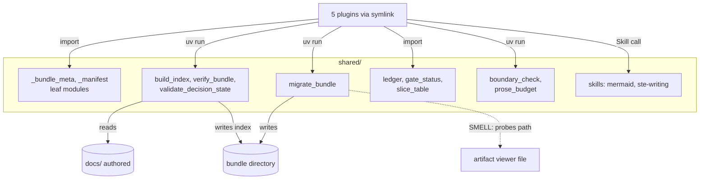
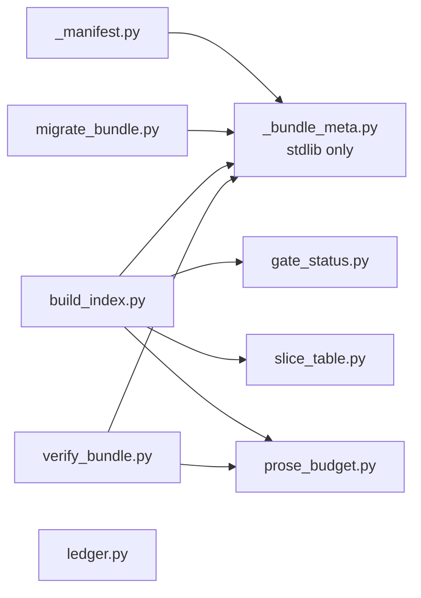

# Bounded Context Canvas — shared

> Documents `shared/` to the [Architecture Documentation Standard](../../standard.md). Grounded in code as of 2026-10-08 (commit `d086be9`). Full treatment. 13 Python files, one doc, and two shared skills. Five symlinks (`plugins/<name>/shared`) point here.

## 1. Name & purpose

**shared** (`shared`). It holds the code that more than one plugin needs: bundle version constants, the record index builder, the bundle verifier, the migration ladder, the comments ledger, the gate and slice parsers, the boundary check, and the prose budget. Two skills, `mermaid` and `ste-writing`, live here too. It is the base layer. It does not depend on a plugin.

## 2. Strategic classification

- **Supporting domain.** Plugins meet at the bundle, and this context defines the bundle contract.
- **Model trait:** shared kernel plus tools run by shell. Small modules are imported. Large tools run by `uv run`.

## 3. Ubiquitous language

| Term | Meaning inside this context |
|------|-----------------------------|
| [**Vendoring**](../../../../DDD-VOCABULARY.md#vendoring) | The symlink of `shared/` into each plugin root (ADR-0017). |
| [**Bundle**](../../../../DDD-VOCABULARY.md#bundle) | The directory whose version, layout, and index this context owns. |
| [**Script**](../../../../DDD-VOCABULARY.md#script) | A PEP 723 file. Here it can also be a module that plugins import. |
| [**Plugin**](../../../../DDD-VOCABULARY.md#plugin) | A consumer. Five plugins hold the symlink. |
| [**Prose budget**](../../../../DDD-VOCABULARY.md#prose-budget) | The word caps in `prose_budget.py`. `verify_bundle.py` fails a bundle past twice the cap. |
| [**Stale boundary**](../../../../DDD-VOCABULARY.md#stale-boundary) | A context that `boundary_check.py` lists. |

## 4. Business / capability decisions (what it owns)

- The bundle version constants, the design stages, and the compatibility gate (`_bundle_meta.py`).
- The record index: `build_index.py` is the only writer of `data/adrs.json` and `data/index.json`.
- The two-ladder migration: layout (`bundle_format`), then data (`schema_version`).
- The bundle verifier and the decision-state validator.
- The comments ledger, the gate-block parser, and the slice-table parser.
- The boundary check and the prose budget.
- It does **not** own: any narrative, ADR text, or viewer code. It does not author content.

## 5. Inbound communication (consumers)

| Consumer | Via |
|----------|-----|
| pr | Import `_bundle_meta` and `_manifest`. Shell: `migrate_bundle`, `build_index`, `verify_bundle` |
| artifact | Import `_bundle_meta`, `ledger`, `gate_status`, and `slice_table`. Shell: `build_index`, `migrate_bundle` |
| implement | Import `slice_table`. Shell: `build_index` |
| architect | Shell only: `build_index`, `migrate_bundle`, `prose_budget`, `boundary_check`, `validate_decision_state` |
| cobuilder-packaging | `watch_feedback.py` imports `ledger` |

## 6. Outbound communication (dependencies + integration pattern)

| Depends on | Integration pattern |
|------------|--------------------|
| Standard library, PyYAML, optional `ulid` | External packages, resolved by `uv` |
| The artifact viewer file | **SMELL.** `migrate_bundle.py` finds and copies `plugins/artifact/viewer/index.html`. See Recorded smells. |
| git | `build_index.py` and `boundary_check.py` run `git` through `subprocess` |

## 7. Public interface (what it publishes)

The symbols in `boundary.yaml` `public_interface`: the `_bundle_meta` constants and functions, `_manifest.rewrite_manifest`, the `ledger` API, `gate_status`, `slice_table`, the shell tools, and the two shared skills.

## 8. Owned data / state

- The code and the two shared skills.
- The derived files it writes into a bundle: `data/index.json`, `data/adrs.json`, `bundle.json` updates, and the refreshed `viewer/index.html` copy.
- It owns no authored source. `docs/` is read, never written, except by the boundary check, which only reads.

---

## C2 — Container diagram

## C3 — Component diagram

**Key invariant(s) (encoded in `boundary.yaml`):** `_bundle_meta.py` imports only the standard library. `ledger.py`, `gate_status.py`, and `slice_table.py` are leaves. No file in `shared/` imports a plugin as Python.

## Recorded smells (→ ADR candidates)

1. **Shared reaches into the artifact plugin.** `migrate_bundle.py` `find_viewer_source` (lines 309-340) probes `plugins/artifact/viewer/index.html` and the sibling `artifact/<version>/viewer/index.html` cache. A warning at line 582 names `plugins/artifact/`. A base layer should not know a plugin path. ADR candidate: pass the viewer path as an argument.
2. **Comments name plugin paths.** `_bundle_meta.py` line 32 names `plugins/artifact/viewer/src/shell/workDeck.ts`. `slice_table.py` lines 23-24 name two plugin scripts. They are comments, so nothing breaks. Replace them with plugin names.
3. **Run-from-cache hazard.** CLAUDE.md warns that the installed cache copy refreshes the viewer with an older build. It is the same coupling as smell 1.

## Governing decisions

ADR-0017 (vendored shared code and bundle compatibility), ADR-0006 (three-phase bundle self-migration), and ADR-0022 (gate doc projection into the index). ADR-0017 and ADR-0022 anchor to `cobuilder-packaging`, so `governed_by` here stays empty. ADR-0017's `require_compatible` gate now exists in `_bundle_meta.py`, and the packaging record from 2026-08-21 was wrong to call it absent.
